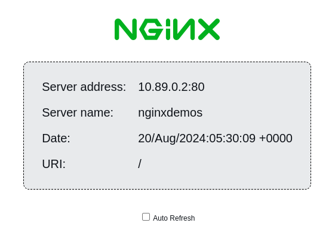

## Deploy Hyper Protect Container Runtime with RedHat Virtualization Services (HPCR RHVS) on IBM Cloud Infrastructure Center (ICIC)

### Preparation

1. Setup ICIC Management node and compute nodes [see details](https://www.ibm.com/products/cloud-infrastructure-center) and make sure to have details like username, password, tenant name, authentication URL and domain name.
2. Prepare your environment according to [these steps](../README.md)

### Provision on ICIC

Initialize terraform:

```bash
terraform init
```

Deploy the example:

```bash
terraform apply
```

### Settings

Use one of the following options to set your settings:

#### Template file

1. Copy contents of `my-settings.auto.tfvars-template` to `my-settings.auto.tfvars`.
    ```bash
    cp my-settings.auto.tfvars-template my-settings.auto.tfvars
    ```
2. Update `my-settings.auto.tfvars` to appropriate values.

#### Environment variables

Set the following environment variables:

```text
TF_VAR_icic_username="ICIC username"
TF_VAR_icic_password="ICIC password"
TF_VAR_icic_tenant_name="ICIC tenant name"
TF_VAR_icic_auth_url="ICIC authentication URL"
TF_VAR_icic_domain_name="ICIC domain name"

TF_VAR_prefix = "prefix for names"
TF_VAR_hpcr_rhvs_image_path = "path to HPCR RHVS qcow2"
TF_VAR_icic_network_name = "ICIC network name"
TF_VAR_icic_target_compute_node = "Target compute node to bring up instance"

TF_VAR_icl_iam_apikey="Your IBM Cloud Logs IAM API Key"
TF_VAR_icl_hostname="Your IBM Cloud Logs Hostname"

TF_VAR_hpcr_rhvs_image_cert_path = "HPCR RHVS encryption certificate path"
```

### Run the Example

Initialize terraform:

```bash
terraform init
```

Deploy the example:

```bash
terraform apply
```

#### Test if the example works

Use your browser to access:

```text
http://<IP>
```

This will show a screen like this:



Destroy the created resources:

```bash
terraform destroy
```
