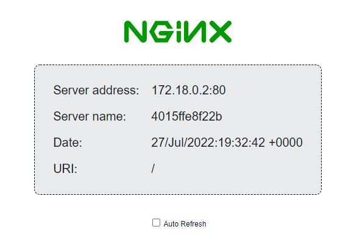

## Hello-World Sample

This sample deploys the [nginx-hello](https://hub.docker.com/r/nginxdemos/hello/) example as a [IBM Cloud Hyper Protect Virtual Server for IBM Cloud VPC](https://cloud.ibm.com/docs/vpc?topic=vpc-about-se) or IBM Secure Execution Virtual Machine for an on-premise libvirt host on z15 or z16.

### Prerequisite

Prepare your environment according to [these steps](../README.md)

### Prerequisite (on-premise only)

Please install the following package.
 - Mac: [cdrtools](https://formulae.brew.sh/formula/cdrtools) 
 - Linux: genisoimage
 - Windows: [cdrtfe](https://cdrtfe.sourceforge.io/)

Please copy your ssh public key (the content of `~/.ssh/id_rsa.pub` typically) to a file `authorized_keys` in your on-premise libvirt host because [terraform connects `libvirtd` in your host through the ssh protocol](https://wiki.libvirt.org/page/SSHSetup).

### Settings

Use one of the following options to set you settings under the `cloud` or `onprem` directory:

#### Template file

1. `cp my-settings.auto.tfvars-template my-settings.auto.tfvars`
2. Fill the values in `my-settings.auto.tfvars`

#### Environment variables

Set the following environment variables:

Under the `cloud` directory
```text
IC_API_KEY=
TF_VAR_zone=
TF_VAR_region=
TF_VAR_logdna_ingestion_key=
TF_VAR_logdna_ingestion_hostname=
```

Under the `onprem` directory
```text
TF_VAR_libvirt_host=
TF_VAR_libvirt_user=
TF_VAR_vsi_image=
TF_VAR_ssh_private_key_path=
TF_VAR_logdna_ingestion_key=
TF_VAR_logdna_ingestion_hostname=
```

### Run the Example

#### Deploy the example on IBM Cloud

Go to the `cloud` directory:

```bash
cd cloud
```

Initialize terraform:

```bash
terraform init
```

Deploy the example:

```bash
terraform apply
```

This will create a sample virtual server instance and prints the public IP address of your VSI as an output to the console. 

#### Register a libvirt hook for port forwarding to your on-premise host

 If you want to access the example (nginx) though a port forwarding, please copy the content of `onprem/port-forward.sh` to `/etc/libvirt/hooks/qemu` in your host, and then run the following command in your host as a root:

 ```bash
 systemctl restart libvirtd.service
 ```

#### Deploy the example on your on-premise host

Go to the `onprem` directory:

```bash
cd onprem
```

Register your host as a known host

```bash
./add_known_host.sh <IP address of your host>
```

Initialize terraform:

```bash
terraform init
```

Deploy the example:

```bash
terraform apply
```

This will create a secure-execution virtual machine on your on-premise host. If you registered a libvirt hook for port fowarding to your host, you can use the IP address of the host to access the example.

Note: If the `terraform apply` is failing with the following error. Add `<xsl:template match="acpi"/>` to the `domain_update.xsl` file. The `domain_update.xsl` has been updated with this change.

```
Error: error defining libvirt domain: unsupported configuration: machine type 's390-ccw-virtio-noble' does not support ACPI
```

#### Test if the example works

Use your browser to access:

```text
http://<IP>
```

This will show a sceen like this:



Destroy the created resources:

```bash
terraform destroy
```
